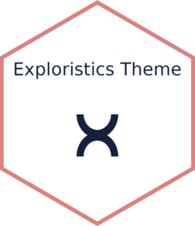

<!-- README.md is generated from README.Rmd. Please edit that file -->

```{r, include = FALSE}
knitr::opts_chunk$set(
  collapse = TRUE,
  comment = "#>",
  fig.path = "man/figures/README-",
  out.width = "100%"
)

# Load R Packages
library(ggplot2)
library(ExploristicsTheme)
library(patchwork)
library(monochromeR)
```

# ExploristicsTheme 

<!-- badges: start -->

[](https://www.repostatus.org/#active/) [](https://github.com/Exploristics/ExploristicsTheme) [](https://github.com/Exploristics/ExploristicsTheme)

<!-- badges: end -->

A bespoke ggplot2 theme that embodies a company's brand identity. Using this theme not only enhances the visual appeal of plots but also ensures consistency across all graphical outputs, reinforcing the brand's presence and professionalism. This theme implements our unique color palette, typography, and stylistic elements. By integrating these brand-specific features into our data visualizations, we aim to provide a cohesive and recognizable look that aligns with our corporate values and aesthetic standards, thereby facilitating clearer communication and a stronger brand connection with our audience.

## Graph Gallery

```{r echo=FALSE, results='asis'}
html_output <- '<div style="display: grid; grid-template-columns: repeat(2, 1fr); gap: 25px;">'

graphs <- c(
  "man/figures/stackedbarplot.jpg",
  "man/figures/doughnut.jpg",
  "man/figures/bubbleplot.jpg",
  "man/figures/boxplot.jpg",
  "man/figures/chloropeth.jpg",
  "man/figures/heatmap.jpg")

for (graph in graphs) {
  img_html <- paste0('')
  html_output <- paste0(html_output, '<div>', img_html, '</div>')
}

html_output <- paste0(html_output, '</div>')
cat(html_output)

```

## Colour Palettes

The \code{ExploristicsTheme} package has a range of colour palettes that are aligned with Exploristics brand but provide flexibility to create bespoke data visualizations. These palettes are:

### Brand

```{r echo=FALSE}
monochromeR::view_palette(ExploristicsTheme::Expl_Brand)
```

### External

```{r echo=FALSE}
monochromeR::view_palette(ExploristicsTheme::Expl_External)
```

### High Contrast

```{r echo=FALSE}
monochromeR::view_palette(ExploristicsTheme::Expl_HighCont)
```

### Expl_Blue

```{r echo=FALSE}
monochromeR::view_palette(ExploristicsTheme::Expl_Blue)
```

## Installation

Currently the ExploristicsTheme package is stored on the Exploristics GitHub [GitHub repo](https://github.com/Expl-DST). At present the repository is a private and requires permission to be granted by a member of the Data Science Team.

To install `ExploristicsTheme` package:

1.  Set up a GitHub account: [GitHub Signup](https://github.com/join)

2.  Enable Multi-Factor Authentication: [MFA Guide](https://docs.github.com/en/authentication/securing-your-account-with-two-factor-authentication-2fa/configuring-two-factor-authentication)

3.  Request access to `ExploristicsTheme` repository.

4.  Run the below code to install latest version of `ExploristicsTheme` package.

``` r
devtools::install_github("https://github.com/Exploristics/ExploristicsTheme")
```

## Code of Conduct

Please note that the KerusCloudVPV project is released with a [Contributor Code of Conduct](https://contributor-covenant.org/version/2/1/CODE_OF_CONDUCT.html). By contributing to this project, you agree to abide by its terms.
