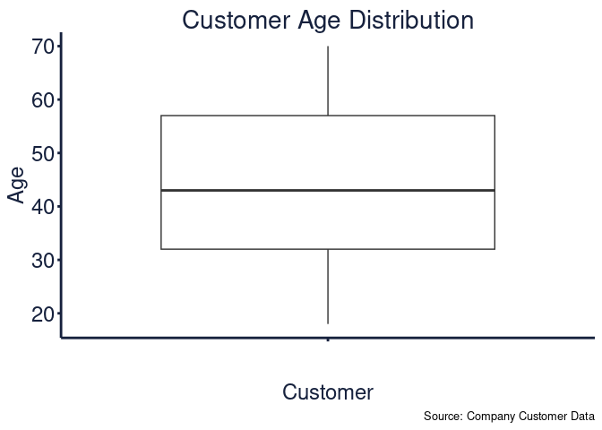

<!-- README.md is generated from README.Rmd. Please edit that file -->

# ExploristicsTheme 

<!-- badges: start -->

[](https://www.repostatus.org/#active/)
[](https://github.com/GABurns/ExploristicsTheme)
[](https://github.com/GABurns/ExploristicsTheme)
<!-- badges: end -->

A bespoke ggplot2 theme that embodies a company’s brand identity. Using
this theme not only enhances the visual appeal of plots but also ensures
consistency across all graphical outputs, reinforcing the brand’s
presence and professionalism. This theme implements our unique color
palette, typography, and stylistic elements. By integrating these
brand-specific features into our data visualizations, we aim to provide
a cohesive and recognizable look that aligns with our corporate values
and aesthetic standards, thereby facilitating clearer communication and
a stronger brand connection with our audience.

## Graph Gallery

### Stacked Coloumn


### Scatterpot

### Time Series


### Boxplot



### Violin


## Installation

Currently the ExploristicsTheme package is stored on the Exploristics
GitHub [GitHub repo](https://github.com/Expl-DST). At present the
repository is a private and requires permission to be granted by a
member of the Data Science Team.

To install `ExploristicsTheme` package:

1.  Set up a GitHub account: [GitHub Signup](https://github.com/join)

2.  Enable Multi-Factor Authentication: [MFA
    Guide](https://docs.github.com/en/authentication/securing-your-account-with-two-factor-authentication-2fa/configuring-two-factor-authentication)

3.  Request access to `ExploristicsTheme` repository.

4.  Run the below code to install latest version of `ExploristicsTheme`
    package.

``` r
devtools::install_github("https://github.com/GABurns/ExploristicsTheme")
```

## Code of Conduct

Please note that the KerusCloudVPV project is released with a
[Contributor Code of
Conduct](https://contributor-covenant.org/version/2/1/CODE_OF_CONDUCT.html).
By contributing to this project, you agree to abide by its terms.
