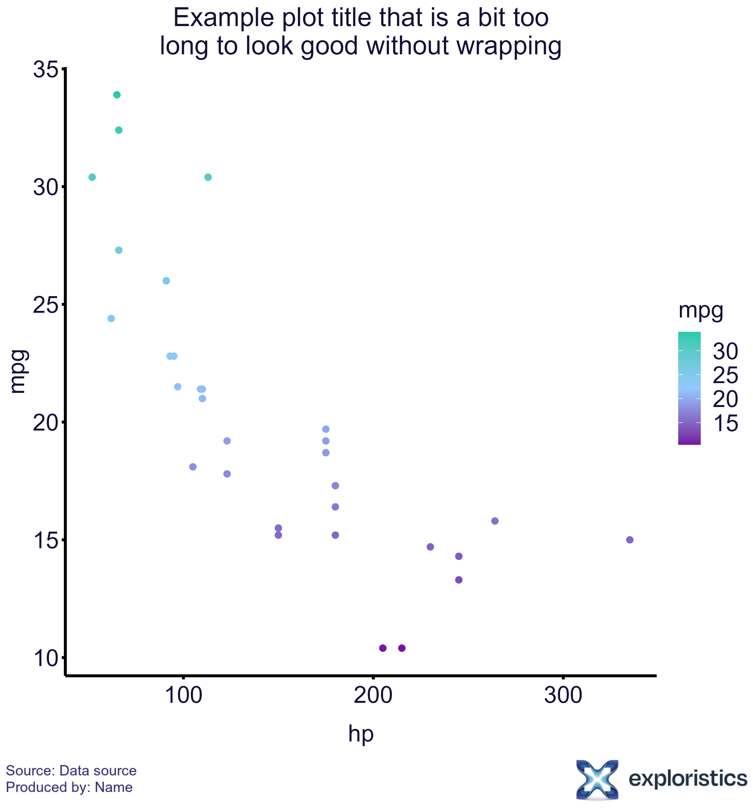

A custom theme and colour schemes for ggplot2.

```{r knit_setup,echo=FALSE}

knitr::opts_chunk$set(dpi=96,fig.width=6,fig.height=6)

```

```{r setup, warning=FALSE, message=FALSE}
library(ExploristicsTheme)
library(ggplot2)
library(magick)
library(magrittr)
library(scales)
library(stringr)

```

## Usage

### Theme
This package provides a `theme()` for use with ggplot2. It has some sensible defaults for font sizes, axis lines etc. You can add it to your plots using `exploristics_theme()`.

```{r theme}
## generate a plot with the Exploristics theme
cars_plot <- ggplot(data = mtcars, aes(x = hp, y = mpg, colour = mpg)) +
  geom_point(size=2) +
  labs(title="Example plot") +
  exploristics_theme()

cars_plot

```

### Colour and Fill
To add a colour scheme to your plot use `exploristics_colour()` and/or `exploristics_fill()`.

```{r colour}
## add colour scheme and wrap text labels
cars_plot %>%
  exploristics_colour(colour_pal="Expl_External")

```

### Text wrapper
If your plot has long titles or labels, use `text_wrapper()` to automatically wrap them on to a new line.

```{r long_title}
## generate a plot with a long title
cars_plot <- ggplot(data = mtcars, aes(x = hp, y = mpg, colour = mpg)) +
  geom_point(size=2) +
  labs(title="Example plot title that is a bit too long to look good without wrapping") +
  exploristics_theme()

cars_plot

```

The title above gets cutoff, but using `text_wrapper()` it will add a new line:

```{r text_wrap}
## add colour scheme and wrap text labels
cars_plot %>%
  exploristics_colour(colour_pal="Expl_External") %>%
  text_wrapper()
```

### Footer
To add a footer to your plot with the Exploristics logo and an optional text caption, first use `ggsave()` to save your plot to an image file. Pass the file to `add_footer()` which will save a new plot with the footer added as a `.png` file.

```{r footer}
## save the last plot generated
ggsave(filename = "example_cars_plot.png", width = 8, height = 8, dpi = 300)

## add the footer to the saved plot with a custom caption
## include `\n` to space your caption over 2 lines
add_footer("example_cars_plot.png", text= "Source: Data source\nProduced by: Name")

```

{width=600px height=640px}
  
  
  
### Overwriting the default theme
If you want to change any option in the `exploristics_theme()` you can add another `theme()` call after it with the formatting you'd like to overwrite.

```{r theme_overwrite}
## generate a plot with the Exploristics theme
ggplot(data = mtcars, aes(x = hp, y = mpg, colour = mpg)) +
  geom_point(size=2) +
  labs(title="Example plot") +
  exploristics_theme()


## add `theme()` to change additional options
ggplot(data = mtcars, aes(x = hp, y = mpg, colour = mpg)) +
  geom_point(size=2) +
  labs(title="Example plot") +
  exploristics_theme() +
  theme(legend.position = "top")

```

### Removing function names from text label
In some cases you may want to plot variables as a specific class, e.g. a `numeric` variable as a `factor`. For this if you use `text_wrapper()` it will automatically clean the axis titles and legend titles to remove the `as.*()` functions applied when creating the plot.

```{r as_function_label}
## use a numeric variable as discrete by using `as.factor()` when setting `fill`
p <- ggplot(data = mtcars, aes(x = cyl, y = mpg, fill = as.factor(cyl))) +
  geom_bar(stat="identity") +
  exploristics_theme()

## the legend title is `as.factor(cyl)`
p %>%
  exploristics_fill(colour_pal="Expl_External")
```

The legend title above would look better with the function call in it.
Using `text_wrapper()` it will leave the legend title as just "cyl":

```{r as_function_removed}
## but using `text_wrapper()` the legend title is now "cyl"
p %>%
  exploristics_fill(colour_pal="Expl_External") %>%
  text_wrapper()

```
  
  
## Potential issues

### using `exploristics_fill()` with `geom_bar()`
When setting the fill of a bar plot the default border, which is set by `colour`, can cause horizontal lines to appear across the bars in the plot.

To fix this set `fill` and `colour` in `aes()` to the same variable and then add `exploristics_fill()` and `exploristics_colour()` with both using the same colour palette.

```{r barplot}
## barplot with both colour and fill specified
cars_plot_col_fill <- ggplot(data = mtcars, aes(x = cyl, y = mpg, fill=as.factor(cyl),colour=as.factor(cyl)))+
geom_bar(stat="identity") +
exploristics_theme()

cars_plot_col_fill %>%
  exploristics_fill(colour_pal="Expl_HighCont") %>%
  exploristics_colour(colour_pal="Expl_HighCont") %>%
  text_wrapper()

```
